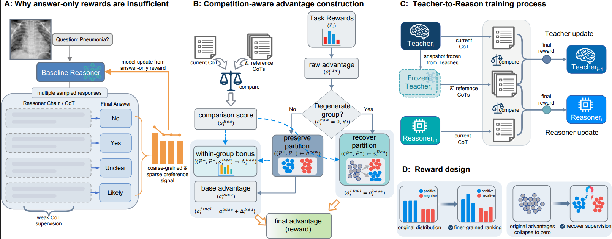

<h1 align="center">Teach-to-Reason</h1>

<p align="center">
  <strong>Teach-to-Reason: Competition-Guided Reasoning with a Self-Improving Teacher</strong>
</p>

<p align="center">
  Supplementary codebase for <strong>Teach-to-Reason (T2R)</strong>, a reinforcement learning framework for training chest X-ray VQA models with comparison-based supervision over medical chain-of-thought reasoning.
</p>

<p align="center">
  <a href="#abstract">Abstract</a> •
  <a href="#overview">Overview</a> •
  <a href="#paper-faithful-training-schedule">Training Schedule</a> •
  <a href="#evaluation-on-your-own-test-set">Evaluation</a>
</p>

<p align="center">
  
</p>

---

> This repository is provided as supplementary material for anonymous review. Author-identifying information has been removed.

## Abstract

> Chest X-ray visual question answering (CXR VQA) requires models not only to predict correct answers, but also to produce reliable medical reasoning. However, existing reinforcement-learning-based training typically relies on answer-level rewards, which are often too coarse to improve chain-of-thought (CoT) quality and can become ineffective when group-level advantages collapse to zero. We propose \textbf{Teach-to-Reason (T2R)}, a framework that introduces comparison-based supervision into CoT optimization through a self-improving \emph{Teacher} and a competition-guided \emph{Reasoner}. As the Teacher is iteratively strengthened via self-competition, the Reasoner is optimized against progressively stronger Teacher-generated references. We further introduce a case-wise reward design that preserves the original reward-induced positive/negative partition when it is informative, and restores supervision from competition scores when the original reward signal degenerates. Experiments on multiple CXR open-ended VQA benchmarks show that T2R consistently outperforms strong baselines, indicating that comparison-based supervision, when integrated in a controlled and principled manner, provides a more effective training signal for reasoning optimization.

## Overview

This project is built around two core modules:

- [EasyR1](./EasyR1): RL training pipeline, including rollout, optimization, checkpointing, and reward-function integration.
- [RayRewardServer](./RayRewardServer): HTTP reward service that uses Ray workers to run Teacher inference and judge-model calls.

The training procedure is organized as **two steps**:

1. Start the Reward Service on the reward node.
2. Start EasyR1 training on the training node.

### Quick Start Map

| Goal | Entry Point |
| --- | --- |
| Locate the implementation of each paper component | [Code Map for the Paper](#code-map-for-the-paper) |
| Prepare configs and checkpoints | [Fields You Need to Modify](#fields-you-need-to-modify) |
| Reproduce the paper training schedule | [Paper-Faithful Training Schedule](#paper-faithful-training-schedule) |
| Run your own trained Reasoner on custom test data | [Evaluation on Your Own Test Set](#evaluation-on-your-own-test-set) |

## Repository Structure

```text
Teach_to_Reason/
├── assets/                  # Paper figures
├── EasyR1/                  # RL training code
├── RayRewardServer/         # Reward service
└── evaluation/              # Evaluation scripts
```

## Code Map for the Paper

### Reward functions

| Component | File |
| --- | --- |
| Teacher reward function | [EasyR1/examples/reward_function/teacher_reward.py](./EasyR1/examples/reward_function/teacher_reward.py) |
| Reasoner reward function | [EasyR1/examples/reward_function/reasoner_reward.py](./EasyR1/examples/reward_function/reasoner_reward.py) |
| RLVR reward function for Reasoner | [EasyR1/examples/reward_function/reasoner_rlvr_reward.py](./EasyR1/examples/reward_function/reasoner_rlvr_reward.py) |

### Advantage construction

| Component | File                                                                |
| --- |---------------------------------------------------------------------|
| Reasoner advantage computation | [EasyR1/examples/reward_function/scpo_score/build_advantage.py](./EasyR1/examples/reward_function/scpo_score/build_advantage.py) |

### Prompt-related implementations

| Purpose | File |
| --- | --- |
| Compare Reasoner CoT against Teacher CoTs | [EasyR1/examples/reward_function/reasoner_helper/compare_with_teacher_utils.py](./EasyR1/examples/reward_function/reasoner_helper/compare_with_teacher_utils.py) |
| Judge whether an open-ended answer is correct | [EasyR1/examples/reward_function/reasoner_helper/open_ended_utils.py](./EasyR1/examples/reward_function/reasoner_helper/open_ended_utils.py) |
| Judge whether a CoT is qualified | [EasyR1/examples/reward_function/reasoner_helper/reason_quality_judge.py](./EasyR1/examples/reward_function/reasoner_helper/reason_quality_judge.py) |
| Build Teacher prompts for CoT generation | [EasyR1/examples/reward_function/reasoner_helper/teacher_infer_preprocess.py](./EasyR1/examples/reward_function/reasoner_helper/teacher_infer_preprocess.py) |

## Training Data Format

The training data loader expects `data.train_files` and `data.val_files` to point to a local Hugging Face dataset saved with `datasets.save_to_disk(...)`. In practice, the config uses the form:

```bash
/path/to/dataset_dir@train
/path/to/dataset_dir@val
```

where `dataset_dir` is loaded by `datasets.load_from_disk(...)`, and `@train` / `@val` selects the split to use.

At minimum, each training sample should contain the following fields:

| Field | Meaning                                                                                                                       |
| --- |-------------------------------------------------------------------------------------------------------------------------------|
| `prompt` | The full training prompt text fed to the Reasoner.                                                                            |
| `answer` | Ground-truth answer used by reward computation and answer verification.                                                       |
| `images` | One image path or a list of image paths. Relative paths are resolved with data.image_dir; only valid existing files are kept. |
| `question_type` | Question type string, such as `open_ended` or `single_choice`.                                                                               |
| `report` | The radiology report or other report-style context used by the reward logic.                                                  |
| `question_info` | A JSON string containing the structured question/answer information used later by reward computation.                         |

Optional fields:

| Field | Meaning |
| --- | --- |
| `split_idx` | Optional integer split tag used by staged training to select subsets of the training data. |
| `data_source` | Optional source name recorded in metadata; if missing, the dataset split name is used. |

Notes:

- If `images` stores relative paths, `data.image_dir` should point to the corresponding image root directory.
- The training loader resolves `question_info` with `json.loads(...)`, so this field should be stored as a JSON-encoded string rather than a nested Python object.
- During loading, the dataset code packages `question_type`, `report`, `images`, `data_source`, and parsed `question_info` into the sample metadata used by the reward function.

Minimal example record:

```json
{
  "prompt": "<reasoner_prompt_built_from_the_template_below>",
  "answer": "Pleural effusion",
  "images": ["images/sample_0001.png"],
  "question_type": "open_ended",
  "report": "There is a small left pleural effusion with adjacent bibasal atelectatic change.",
  "question_info": "{\"question\": \"What abnormality is present in this chest X-ray?\", \"answer\": \"Pleural effusion\"}",
  "split_idx": 1,
  "data_source": "example_dataset"
}
```

The `prompt` field should be constructed from the Reasoner prompt template used in the paper. Users can follow the template below when preparing Reasoner training data. See Appendix B.2 of the paper for details.

````text
You will be given one or more chest X-ray images and an exam question. First, carefully inspect the X-ray image(s), then combine your observations with the question to reason step by step and produce a final answer.

Important requirements:
- In your reasoning, it is recommended (but not mandatory) to follow a natural sequence such as: "inspect the image(s) -> describe key findings -> analyze these findings in the context of the question -> reach a conclusion". The exact wording can be fully free-form and does not need to follow any fixed template.
- The reasoning should clearly explain what you see on the image(s), what these findings imply, and how they lead step by step to your final answer. Do not invent imaging findings or test results that are not actually supported by the X-ray image(s).

Additional notes:
- Question type: {question_type}.
- The expected answer format for this type is described as follows (this is only to constrain the format of <answer>; you do not need to mention it in your reasoning):
{question_type_desc}

Question:
{question}

Based on what you see on the chest X-ray image(s) and the question, produce your response as a single XML structure in the following format:

```xml
<response>
    <reason>(fill in the complete reasoning here, in natural English as a continuous description)</reason>
    <answer>(fill in the final answer here, and make sure its format matches the requirement)</answer>
</response>
```

Do not output anything outside this XML code block.

Your Output:
````

For the exact dataset handling logic, please refer to [EasyR1/verl/utils/reasoner_dataset.py](./EasyR1/verl/utils/reasoner_dataset.py).


## Configuration Files

### EasyR1 configs

All EasyR1 configs are located in [EasyR1/examples/configs](./EasyR1/examples/configs):

- `reasoner_t2r_2b.yaml`
- `reasoner_t2r_4b.yaml`
- `reasoner_rlvr_2b.yaml`
- `reasoner_rlvr_4b.yaml`
- `teacher_t2r_2b.yaml`
- `teacher_t2r_4b.yaml`

### Reward service configs

All Reward Service configs are located in [RayRewardServer/configs](./RayRewardServer/configs):

- `reasoner_reward_2b_service.yaml`
- `reasoner_reward_4b_service.yaml`
- `teacher_reward_2b_service.yaml`
- `teacher_reward_4b_service.yaml`


## Fields You Need to Modify

Before launching training, you should update the following fields according to your own environment, model checkpoints, and dataset paths.

> [!IMPORTANT]
> Models trained with EasyR1 are saved as FSDP checkpoints. Before reusing them in later training stages, evaluation, or Reward Service configs, you need to convert them into Hugging Face format with [EasyR1/scripts/model_merger.py](./EasyR1/scripts/model_merger.py).
>
> Example:
> ```bash
> cd EasyR1
> python scripts/model_merger.py --local_dir /path/to/checkpoint/actor
> ```
>
> After conversion, use the merged Hugging Face model path in the relevant config files, such as:
> `worker.actor.model.model_path`,
> `handlers.teacher_inference.init_kwargs.model_path`,
> and the evaluation model paths in [evaluation/configs/qwen3_4b.yaml](./evaluation/configs/qwen3_4b.yaml).

### EasyR1 config fields

| Field | Meaning |
| --- | --- |
| `data.train_files` | Training dataset path, usually in `path@split` format for Hugging Face datasets. |
| `data.val_files` | Validation dataset path used during training-time evaluation. |
| `data.image_dir` | Root directory of the image files if dataset entries store relative image paths. |
| `data.split_idx` | Data split selection. Different training stages may use different splits, so this should match the paper setting. |
| `worker.actor.model.model_path` | Checkpoint path of the current actor / reasoner model to train or continue training from. |

### Reward service config fields

| Field | Meaning |
| --- | --- |
| `handlers.teacher_inference.init_kwargs.model_path` | Teacher model checkpoint path used to generate teacher CoTs. |
| `handlers.qwen_chatbot.init_kwargs.model_path` | Judge model checkpoint path used for answer judging, CoT comparison, and other reward-related calls. |
| `handlers.*.num_workers` | Number of workers launched for each handler; controls inference throughput. |
| `handlers.*.gpu_per_worker` | GPU resources allocated to each worker; should match the actual available hardware. |

## Installation

We recommend installing dependencies inside both submodules.

### EasyR1

```bash
cd EasyR1
pip install -e .
pip install -r requirements.txt
```

### RayRewardServer

```bash
cd RayRewardServer
pip install -r requirements.txt
```

If both modules share the same Python environment, it is also recommended to ensure the following packages are available:

```bash
pip install requests xmltodict
```

## Training Workflow

At the systems level, the workflow is:

1. Start `RayRewardServer` on the reward node.
2. Verify the reward service is healthy.
3. Start the EasyR1 Ray cluster on the training node.
4. Submit the RL training job.

EasyR1 communicates with the reward service through the following environment variables:

- `REWARD_SERVICE_HOST`
- `REWARD_SERVICE_PORT`

The health-check endpoint is:

```bash
curl http://<reward_node_ip>:8686/health
```

## Paper-Faithful Training Schedule

T2R follows a staged training schedule rather than a single Teacher-training / Reasoner-training pass. The training schedule used in the paper uses different data splits for initialization and subsequent optimization:
- Split `0`: used to obtain the initial Reasoner `R0` via RLVR.
- Splits `1` to `3`: used for staged Teacher self-competition and staged Reasoner optimization.
- Teacher `T0` and initial Reasoner `Rinit` are initialized from the **same pretrained model**.
- The Teacher is used **only during training**. The final inference model is the Reasoner.

### Stage Summary

| Stage | Model update | Data split | Result |
| --- | --- | --- | --- |
| Initialization | Train `Rinit` with RLVR | `split 0` | `R0` |
| Teacher stage 1 | Self-competition starting from `T0` | `split 1` | `T1` |
| Teacher stage 2 | Self-competition starting from `T1` | `split 2` | `T2` |
| Teacher stage 3 | Self-competition starting from `T2` | `split 3` | `T3` |
| Reasoner stage 1 | Optimize `R0` against `T1` | `split 1` | `R1` |
| Reasoner stage 2 | Optimize `R1` against `T2` | `split 2` | `R2` |
| Reasoner stage 3 | Optimize `R2` against `T3` | `split 3` | `R3` |

In the paper, this staged schedule is described as:

`Rinit -> RLVR on split 0 -> R0`

`T0 -> T1 -> T2 -> T3` via Teacher self-competition on splits `1, 2, 3`

`R0 -> R1 -> R2 -> R3` via competition-guided Reasoner optimization against progressively improved Teachers

## Experimental Pipeline: Teacher and Reasoner

In this repository, the corresponding code roles are:

- Teacher training configs: `EasyR1/examples/configs/teacher_t2r_2b.yaml` and `teacher_t2r_4b.yaml`
- Teacher reward function: `EasyR1/examples/reward_function/teacher_reward.py`
- Reasoner T2R configs: `EasyR1/examples/configs/reasoner_t2r_2b.yaml` and `reasoner_t2r_4b.yaml`
- Reasoner RLVR configs: `EasyR1/examples/configs/reasoner_rlvr_2b.yaml` and `reasoner_rlvr_4b.yaml`
- Reasoner T2R reward function: `EasyR1/examples/reward_function/reasoner_reward.py`
- Reasoner RLVR reward function: `EasyR1/examples/reward_function/reasoner_rlvr_reward.py`
- Reward service configs: `RayRewardServer/configs/teacher_reward_2b_service.yaml`, `teacher_reward_4b_service.yaml`, `reasoner_reward_2b_service.yaml`, and `reasoner_reward_4b_service.yaml`

### Stage 0: Obtain the Initial Reasoner `R0`

To reproduce the paper setting, first train the initial Reasoner with **RLVR on split 0** for one epoch to obtain `R0`. This step is important because all later T2R and baseline Reasoner variants start from the same `R0`.

In practice, this means:

- use the Reasoner RLVR objective
- set `data.split_idx` to `0`
- save the resulting checkpoint as the starting point for later staged training

A representative command is:

```bash
cd /path/to/Teach_to_Reason/EasyR1

export WORKSPACE=/path/to/Teach_to_Reason/EasyR1
export EXP_NAME=reasoner_rlvr_init_split0
export SAVE_DIR=/path/to/checkpoints/${EXP_NAME}

ray job submit \
  --address "http://${RL_HEAD_IP}:${RL_DASH_PORT}" \
  --runtime-env-json "${RUNTIME_ENV_JSON}" \
  -- python -m verl.trainer.main \
    config="examples/configs/reasoner_rlvr_2b.yaml" \
    data.split_idx=0 \
    worker.reward.reward_function="${WORKSPACE}/examples/reward_function/reasoner_rlvr_reward.py:compute_score" \
    trainer.experiment_name="${EXP_NAME}" \
    trainer.save_checkpoint_path="${SAVE_DIR}" \
    trainer.n_gpus_per_node="${NPROC}" \
    trainer.nnodes=1
```

After this step, the output checkpoint is your `R0`.

### Stage 1: Train the Teacher on Splits 1-3

Teacher training is a **self-competition** process. For each stage `i`, the current Teacher `Ti` is frozen as a reference `T̃i`, and the trainable Teacher is updated against that frozen snapshot.

In code:

- config: `examples/configs/teacher_t2r_2b.yaml`
- reward function: `examples/reward_function/teacher_reward.py:compute_score`

To reproduce the staged setting used in the paper, run three Teacher stages:

- Stage 1 with `data.split_idx=1` to get `T1`
- Stage 2 with `data.split_idx=2` and `worker.actor.model.model_path=<path_to_T1>` to get `T2`
- Stage 3 with `data.split_idx=3` and `worker.actor.model.model_path=<path_to_T2>` to get `T3`

A representative stage command is:

```bash
cd /path/to/Teach_to_Reason/EasyR1

export WORKSPACE=/path/to/Teach_to_Reason/EasyR1
export EXP_NAME=teacher_t2r_stage1
export SAVE_DIR=/path/to/checkpoints/${EXP_NAME}

ray job submit \
  --address "http://${RL_HEAD_IP}:${RL_DASH_PORT}" \
  --runtime-env-json "${RUNTIME_ENV_JSON}" \
  -- python -m verl.trainer.main \
    config="examples/configs/teacher_t2r_2b.yaml" \
    data.split_idx=1 \
    worker.reward.reward_function="${WORKSPACE}/examples/reward_function/teacher_reward.py:compute_score" \
    trainer.experiment_name="${EXP_NAME}" \
    trainer.save_checkpoint_path="${SAVE_DIR}" \
    trainer.n_gpus_per_node="${NPROC}" \
    trainer.nnodes=1
```

### Stage 2: Refresh the Reward Service Teacher Checkpoint

Once a new Teacher checkpoint is obtained, update the Reward Service so that `teacher_inference` uses the correct staged Teacher.

- `RayRewardServer/configs/teacher_reward_2b_service.yaml`
- `RayRewardServer/configs/reasoner_reward_2b_service.yaml`

The key field is:

- `handlers.teacher_inference.init_kwargs.model_path`

Point this field to the newly trained Teacher checkpoint, then restart the Reward Service. This step is important because both Teacher-side and Reasoner-side reward computation rely on the `teacher_inference` handler to generate Teacher CoTs.

For the staged setting used in the paper:

- before Reasoner stage 1, point the reward service to `T1`
- before Reasoner stage 2, point the reward service to `T2`
- before Reasoner stage 3, point the reward service to `T3`

### Stage 3: Train the Reasoner with T2R on Splits 1-3

After the Reward Service has been refreshed with the staged Teacher, the Reasoner is optimized against Teacher-generated reference CoTs.

In code:

- config: `examples/configs/reasoner_t2r_2b.yaml`
- reward function: `examples/reward_function/reasoner_reward.py:compute_score`
- competition-aware advantage logic: `build_advantage.py`

To reproduce the staged setting used in the paper, run:

- Reasoner stage 1: initialize from `R0`, set `data.split_idx=1`, use Teacher `T1`, obtain `R1`
- Reasoner stage 2: initialize from `R1`, set `data.split_idx=2`, use Teacher `T2`, obtain `R2`
- Reasoner stage 3: initialize from `R2`, set `data.split_idx=3`, use Teacher `T3`, obtain `R3`

In this stage, `reasoner_reward.py` applies the case-wise T2R reward design:

- if the base task reward already induces a non-degenerate partition, competition scores refine ordering within the positive and negative subsets
- if the group-level base advantage collapses to zero, the final training signal is reconstructed directly from competition scores

A representative stage command is:

```bash
cd /path/to/Teach_to_Reason/EasyR1

export WORKSPACE=/path/to/Teach_to_Reason/EasyR1
export EXP_NAME=reasoner_t2r_stage1
export SAVE_DIR=/path/to/checkpoints/${EXP_NAME}

ray job submit \
  --address "http://${RL_HEAD_IP}:${RL_DASH_PORT}" \
  --runtime-env-json "${RUNTIME_ENV_JSON}" \
  -- python -m verl.trainer.main \
    config="examples/configs/reasoner_t2r_2b.yaml" \
    data.split_idx=1 \
    worker.reward.reward_function="${WORKSPACE}/examples/reward_function/reasoner_reward.py:compute_score" \
    trainer.experiment_name="${EXP_NAME}" \
    trainer.save_checkpoint_path="${SAVE_DIR}" \
    trainer.n_gpus_per_node="${NPROC}" \
    trainer.nnodes=1
```

## Practical Reproduction Notes

- The paper runs on **two compute nodes**, one for RL training and one for the unified reward service.
- In the reported setup, each node has **8 NVIDIA L40 GPUs (48GB)**.
- The paper uses `K = 10` Teacher-generated reference CoTs per sample for competition scoring.
- The paper setting uses GRPO group size `16`, batch size `128`, safety coefficient `alpha = 0.9`, and degenerate-case threshold `gamma = 0.3`.
- Pairwise CoT comparison and open-ended answer verification are both handled by `Qwen3-4B-Instruct-2507` in the paper setup.
- The paper's staged split protocol is:
  - `split 0`: RLVR initialization for `R0`
  - `split 1`: first staged Teacher / Reasoner update
  - `split 2`: second staged Teacher / Reasoner update
  - `split 3`: third staged Teacher / Reasoner update
- `worker.actor.model.model_path` should be updated stage by stage:
  - Teacher stages: `T0 -> T1 -> T2`
  - Reasoner stages: `R0 -> R1 -> R2`
- After changing `handlers.teacher_inference.init_kwargs.model_path`, always restart `RayRewardServer` before launching the next stage.

## Step 1: Start Reward Service on the Reward Node

The example below uses `reasoner_reward_2b_service.yaml`.

```bash
cd /path/to/Teach_to_Reason/RayRewardServer

export NPROC=$(nvidia-smi -L | wc -l)
export REWARD_HEAD_IP=<reward_node_ip>
export REWARD_RAY_PORT=2600
export REWARD_DASH_PORT=8365
export REWARD_CLIENT_PORT=20001
export REWARD_HTTP_PORT=8686

ray stop || true

ray start --head \
  --node-ip-address="${REWARD_HEAD_IP}" \
  --port="${REWARD_RAY_PORT}" \
  --dashboard-host=0.0.0.0 \
  --dashboard-port="${REWARD_DASH_PORT}" \
  --ray-client-server-port="${REWARD_CLIENT_PORT}" \
  --num-gpus="${NPROC}"

python server.py \
  --config configs/reasoner_reward_2b_service.yaml \
  --ray-address "ray://${REWARD_HEAD_IP}:${REWARD_CLIENT_PORT}" \
  cluster.nnodes=1 \
  cluster.gpus_per_node="${NPROC}" \
  server.host="0.0.0.0" \
  server.port="${REWARD_HTTP_PORT}"
```

After the service starts, you can verify it with:

```bash
curl http://${REWARD_HEAD_IP}:${REWARD_HTTP_PORT}/health
```

### Notes

- The handler names `teacher_inference` and `qwen_chatbot` should be kept unchanged, because the reward logic in EasyR1 calls these endpoints by name.
- `handlers.*.num_workers` and `handlers.*.gpu_per_worker` should be adjusted according to the GPU resources on the reward node.
- In the paper setup, the reward node hosts **one Teacher serving instance** for reference CoT generation and **multiple judge instances** for pairwise CoT comparison and answer verification.

## Step 2: Start EasyR1 on the Training Node

The example below assumes a single training node and a separate reward node.

First, start the EasyR1 Ray head on the training node:

```bash
cd /path/to/Teach_to_Reason/EasyR1

export WORKSPACE=/path/to/Teach_to_Reason/EasyR1
export NPROC=$(nvidia-smi -L | wc -l)
export RL_HEAD_IP=<train_node_ip>
export RL_RAY_PORT=2000
export RL_DASH_PORT=8265

export REWARD_SERVICE_HOST=<reward_node_ip>
export REWARD_SERVICE_PORT=8686

export EXP_NAME=reasoner_exp
export TENSORBOARD_DIR=/path/to/tensorboard_logs/${EXP_NAME}
export SAVE_DIR=/path/to/checkpoints/${EXP_NAME}

export RUNTIME_ENV_JSON=$(cat <<EOF
{
  "env_vars": {
    "REWARD_SERVICE_HOST": "${REWARD_SERVICE_HOST}",
    "REWARD_SERVICE_PORT": "${REWARD_SERVICE_PORT}",
    "EXP_NAME": "${EXP_NAME}",
    "TENSORBOARD_DIR": "${TENSORBOARD_DIR}",
    "PYTHONPATH": "${WORKSPACE}"
  }
}
EOF
)

ray stop || true

ray start --head \
  --node-ip-address="${RL_HEAD_IP}" \
  --port="${RL_RAY_PORT}" \
  --dashboard-host=0.0.0.0 \
  --dashboard-port="${RL_DASH_PORT}" \
  --num-gpus="${NPROC}"
```

Once the reward service is ready, submit the training job.

### T2R training for Reasoner

This section shows a representative 2B T2R Reasoner training command.

```bash
cd /path/to/Teach_to_Reason/EasyR1

ray job submit \
  --address "http://${RL_HEAD_IP}:${RL_DASH_PORT}" \
  --runtime-env-json "${RUNTIME_ENV_JSON}" \
  -- python -m verl.trainer.main \
    config="examples/configs/reasoner_t2r_2b.yaml" \
    worker.reward.reward_function="${WORKSPACE}/examples/reward_function/reasoner_reward.py:compute_score" \
    trainer.experiment_name="${EXP_NAME}" \
    trainer.save_checkpoint_path="${SAVE_DIR}" \
    trainer.n_gpus_per_node="${NPROC}" \
    trainer.nnodes=1
```

### RLVR training for Reasoner

This corresponds to the training logic in `train_reasoner_2b_rlvr.sh`.

```bash
cd /path/to/Teach_to_Reason/EasyR1

ray job submit \
  --address "http://${RL_HEAD_IP}:${RL_DASH_PORT}" \
  --runtime-env-json "${RUNTIME_ENV_JSON}" \
  -- python -m verl.trainer.main \
    config="examples/configs/reasoner_rlvr_2b.yaml" \
    worker.reward.reward_function="${WORKSPACE}/examples/reward_function/reasoner_rlvr_reward.py:compute_score" \
    trainer.experiment_name="${EXP_NAME}" \
    trainer.save_checkpoint_path="${SAVE_DIR}" \
    trainer.n_gpus_per_node="${NPROC}" \
    trainer.nnodes=1
```

## Pre-launch Checklist

- Dataset paths in `EasyR1/examples/configs` have been updated.
- Model paths in `EasyR1/examples/configs` have been updated.
- Teacher and judge model paths in `RayRewardServer/configs` have been updated.
- The training node can access `http://<reward_node_ip>:8686/health`.
- `worker.reward.reward_function` is given as an absolute path.
- `trainer.nnodes` matches the actual number of training nodes.
- `trainer.n_gpus_per_node` matches the actual number of GPUs per node.

## Common Config Pairings

To switch model size or training stage, you usually only need to replace the following config files.

### Training configs

- `examples/configs/reasoner_t2r_2b.yaml`
- `examples/configs/reasoner_t2r_4b.yaml`
- `examples/configs/reasoner_rlvr_2b.yaml`
- `examples/configs/reasoner_rlvr_4b.yaml`

### Reward service configs

- `configs/reasoner_reward_2b_service.yaml`
- `configs/reasoner_reward_4b_service.yaml`

## Evaluation on Your Own Test Set

The scripts in [evaluation](./evaluation) support evaluation on custom test data with user-specified input files, model checkpoints, and output directories.

The workflow is:

1. Prepare your own test set as a `.json` or `.jsonl` file.
2. Run Reasoner inference with `evaluation/vqa_run.py`.
3. Evaluate open-ended answers with either:
   - `evaluation/vqa_evaluate.py` using a local Qwen3-4B judge
   - `evaluation/vqa_evaluate_api.py` using an API-based judge

### Input Data Format

Each sample should contain the following fields:

```json
{
  "idx": "sample_0001",
  "question_type": "open_ended",
  "images": ["/absolute/path/to/image.png"],
  "question_info": {
    "question": "What abnormality is present in this chest X-ray?",
    "answer": "Pleural effusion"
  }
}
```

The provided evaluation scripts support the following two question types:

- `open_ended`
- `single_choice`

Additional requirements:

- `images` must be a non-empty list of image paths.
- For `single_choice`, `question_info` must also contain `choices`.
- `question_info.answer` should be the ground-truth answer in the format expected by that question type.

For example, a single-choice sample looks like:

```json
{
  "idx": "sample_0002",
  "question_type": "single_choice",
  "images": ["/absolute/path/to/image.png"],
  "question_info": {
    "question": "What is the most likely diagnosis?",
    "answer": "B",
    "choices": {
      "A": "Normal",
      "B": "Pneumonia",
      "C": "Pneumothorax",
      "D": "Pleural effusion"
    }
  }
}
```

### Run Reasoner Inference

Use [evaluation/vqa_run.py](./evaluation/vqa_run.py) to generate model predictions on your test file:

```bash
python evaluation/vqa_run.py \
  --config evaluation/configs/qwen3_4b.yaml \
  --input-file /path/to/test.json \
  --model /path/to/your/reasoner_checkpoint \
  --output-dir /path/to/reasoner_predictions
```

[evaluation/configs/qwen3_4b.yaml](./evaluation/configs/qwen3_4b.yaml) provides a default local configuration for inference and answer verification with `Qwen3-4B-Instruct-2507`.
Useful options:

- `--max-images-per-sample`: limit the number of images used for each sample
- `--image-path-replace-src` and `--image-path-replace-dst`: useful if your JSON stores old path prefixes that need to be remapped in the current environment

The output directory will contain one JSON file per sample, including:

- original sample fields
- `response_list`
- `answer_info`

### Evaluate Open-Ended Answers with Local Qwen3

Use [evaluation/vqa_evaluate.py](./evaluation/vqa_evaluate.py) together with [evaluation/configs/qwen3_4b.yaml](./evaluation/configs/qwen3_4b.yaml):

```bash
python evaluation/vqa_evaluate.py \
  --config evaluation/configs/qwen3_4b.yaml \
  --pred-dir /path/to/reasoner_predictions \
  --output-dir /path/to/reasoner_predictions/evaluate_results
```

Behavior summary:

- `open_ended` samples are judged by  the local Qwen3 model.
- `single_choice` samples are scored with rule-based exact matching.
- `evaluation/configs/qwen3_4b.yaml` is provided to help users quickly validate results with a **local** `Qwen3-4B-Instruct-2507` deployment.

### Evaluate Open-Ended Answers with API Judge

Use [evaluation/vqa_evaluate_api.py](./evaluation/vqa_evaluate_api.py) together with [evaluation/configs/qwen235b.yaml](./evaluation/configs/qwen235b.yaml):

```bash
python evaluation/vqa_evaluate_api.py \
  --config evaluation/configs/qwen235b.yaml \
  --pred-dir /path/to/reasoner_predictions \
  --output-dir /path/to/reasoner_predictions/qwen_235b_evaluate_results
```

This script is intended for the API-based judging setup described in the paper.

- [evaluation/configs/qwen235b.yaml](./evaluation/configs/qwen235b.yaml) is used in this paper for API-based answer judging with `qwen3-235b-a22b`.
- The provided API-based configuration is included as a reference for the evaluation protocol used in the paper.
- Users should replace the endpoint and credentials with their own accessible judge service when reproducing the API-based evaluation.
